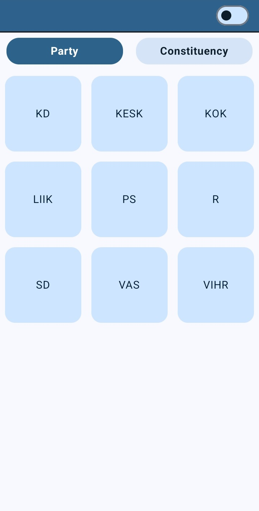
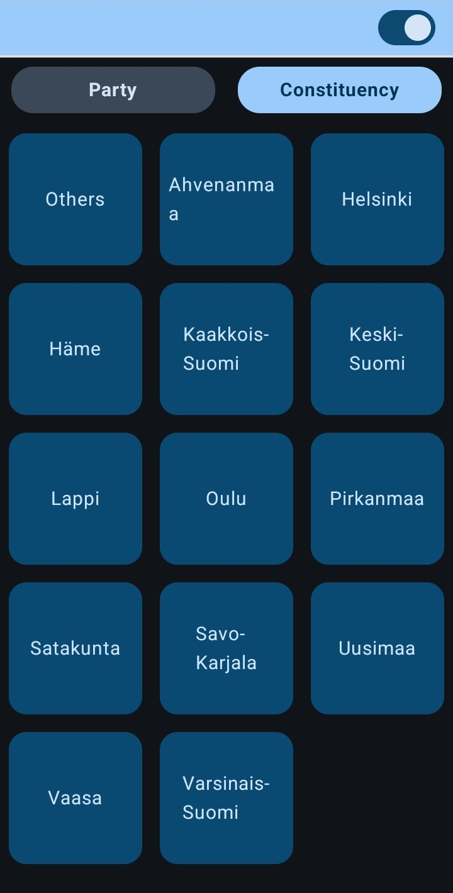
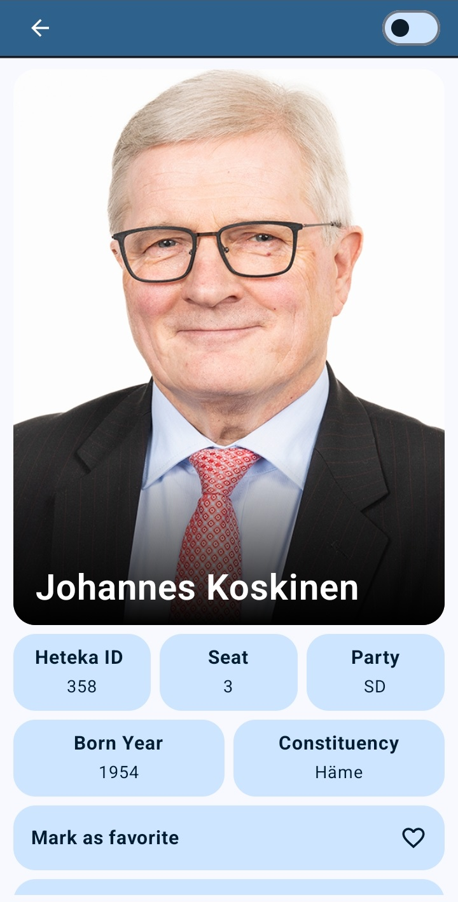
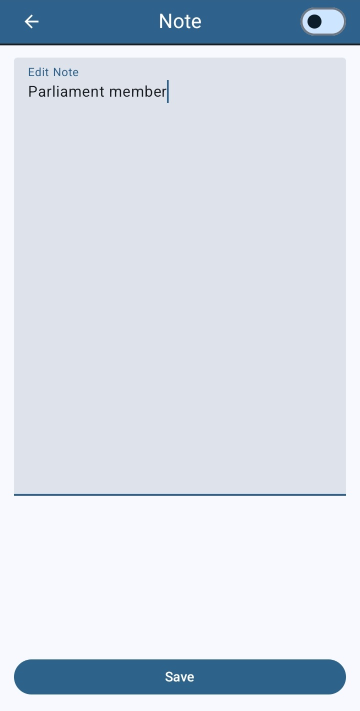

# Parliament Members App

**Parliament Members App** is an Android application designed to showcase the Finnish Parliament members. It utilizes modern Android development technologies such as Jetpack Compose for UI, Room for offline data storage, WorkManager for background data sync, and DataStore for managing preferences like theme switching.

## Features

- **Jetpack Compose UI**: A fully modern UI built using Jetpack Compose, providing smooth and dynamic layouts.
- **Offline Storage**: Uses Room Database to store parliament members' data for offline access.
- **Image Caching**: Images are stored locally to reduce network transmission.
- **Theme Switching**: Users can toggle between Light and Dark themes with persistent preferences managed via DataStore.
- **WorkManager Integration**: Background syncing and periodic updates to fetch the latest parliament members' data.
- **MVVM Architecture**: Well-structured app using the Model-View-ViewModel architecture to ensure separation of concerns and scalability.

## Tech Stack

- **Programming Language**: Kotlin
- **UI**: Jetpack Compose, Material 3
- **Data Storage**: Room Database
- **Theme Preferences**: DataStore
- **Networking**: Retrofit, Coil
- **Background Work**: WorkManager
- **Architecture**: MVVM (Model-View-ViewModel) with Repository pattern
- **Coroutines & Flow**: For managing background tasks and asynchronous operations

## Screenshots
|  |  |  |
|:------------------------------------:|:------------------------------------:|:------------------------------------:|
| Home screen | Dark mode| Member list |

|  |  |
|:------------------------------------:|:------------------------------------:|
| Member details screen | Note editing screen |
  
## Installation

1. Clone the repository:

   ```bash
   git clone https://github.com/MKRadius/ParliamentMembers.git
   cd ParliamentMembers
   ```

2. Open the project in Android Studio.

3. Build and run the project on an emulator or physical device running Android 6.0 (API 23) or higher.

## Usage

### 1. Main Screen
Displays a list of Finnish Parliament members fetched from an API and stored locally using Room. Data is synced periodically using WorkManager.

### 2. Theme Switching
Users can toggle between Light and Dark themes via a switch in the top bar. The selected theme preference is saved using DataStore, so the theme persists between sessions.

### 3. Data Synchronization
The app fetches new data every 24 hours using WorkManager and updates the local Room database. The synchronization is done in the background without interrupting the user experience.

## Architecture

The app follows MVVM (Model-View-ViewModel) architecture:
- **Model**: Manages the data layer, interacts with Room Database and network APIs.
- **ViewModel**: Connects the Model with the Composables, holds UI state, and handles logic.
- **View (Jetpack Compose)**: The user interface layer that reacts to changes in state from the ViewModel.

## Data Flow

1. **Fetch Data**: WorkManager periodically fetches new data from the API and updates the Room database.
2. **Offline Access**: Room stores the fetched data locally so users can view it offline.
3. **Theme Persistence**: DataStore is used to store user preferences, like theme choice.

## Future Improvements

- **Search Functionality**: Add a search bar to filter parliament members by name or party.
- **Unit Tests**: Write unit tests for ViewModels and Repositories to ensure correctness.
- **Error Handling**: Implement better error handling and UI feedback for network failures.
- **Animations**: Add animations to make the UI more engaging and interactive.

---

### Additional Notes

_This project has been produced with assistance from OpenAI's ChatGPT-4. This large language model has provided suggestions and solutions that have assisted the author in producing and supplementing the material. While their contribution has been significant, the final responsibility for the content and its correctness resides with the author._